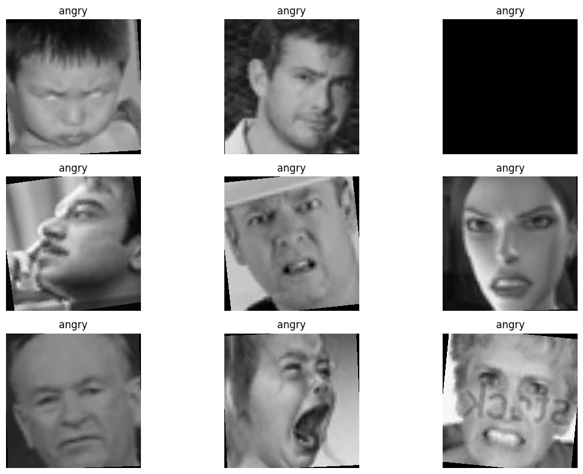

# Dataset Information

## Emotion Based Stress Classification using DL

### Dataset Overview: FER-2013
The dataset used in this project is the **Facial Expression Recognition (FER-2013) Dataset**. It consists of 48x48 pixel grayscale images of faces, which are automatically centered and cropped. 

* **Kaggle Link**: [FER-2013 Dataset on Kaggle](https://www.kaggle.com/datasets/msambare/fer2013)
* **Format**: Folder-based structure containing PNG images of faces categorized by emotion.
* **Input dimensions (for Swin Transformer)**: Grayscale images are loaded as RGB, resized to `224x224` pixels, and normalized.

---

### Dataset Structure & Distribution
The dataset is split into `train` and `test` directories. In total, it comprises **35,887 images** distributed across 7 facial expression classes:

| Class Name | Training Images | Testing Images | Total Images | Stress Mapping Category |
| :--- | :---: | :---: | :---: | :--- |
| **angry** | 3,995 | 958 | 4,953 | **Stress (High)** |
| **disgust** | 436 | 111 | 547 | **Stress (High)** |
| **fear** | 4,097 | 1,024 | 5,121 | **Stress (High)** |
| **happy** | 7,215 | 1,774 | 8,989 | **Non-Stress (Relaxed)** |
| **neutral** | 4,965 | 1,233 | 6,198 | **Non-Stress (Neutral)** |
| **sad** | 4,830 | 1,247 | 6,077 | **Stress (High)** |
| **surprise** | 3,171 | 831 | 4,002 | **Non-Stress (Aroused)** |
| **Total** | **28,709** | **7,178** | **35,887** | |

---

### Dataset Visual Preview
Below is a grid of 9 random sample faces from the dataset labeled with their respective emotion classes, showing the natural variety in illumination, scale, and facial geometry:

---

### Augmentation & Preprocessing
To improve model robustness and prevent overfitting, the training pipeline applies the following real-time data augmentations via `torchvision.transforms`:
1. **Resizing**: Scaled to `224x224` to match the Swin Transformer expected input dimensions.
2. **Random Horizontal Flip**: Simulates facial symmetry variations.
3. **Random Rotation**: Rotates up to 10 degrees to handle slight head tilts.
4. **Color Jitter**: Randomly adjusts brightness (0.2) and contrast (0.2) to simulate different lighting conditions.
5. **Normalization**: Standardized to mean `[0.5, 0.5, 0.5]` and standard deviation `[0.5, 0.5, 0.5]`.
