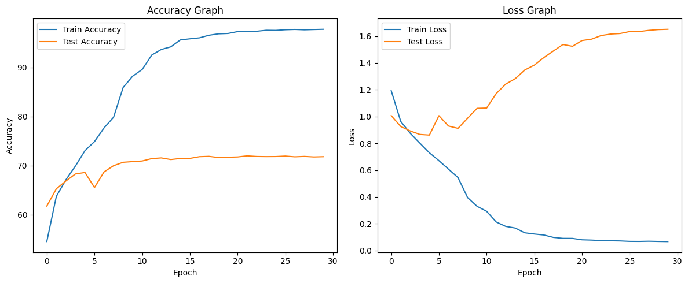
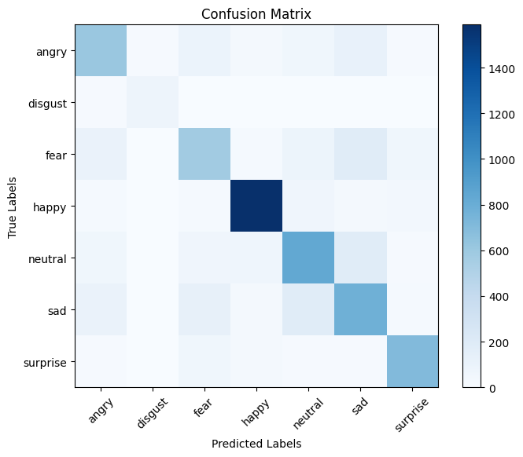

# Emotion Based Stress Classification using DL

## Project Proposal & Contribution Overview

This project is contributed under **GSSoC 2026** (GirlScript Summer of Code).

### Project Description
* **Project Title**: Emotion Based Stress Classification using DL
* **Aim**: The aim of this project is to find out the stress level of a human being by their emotions using deep learning methods.
* **Dataset**: [FER-2013 (Facial Expression Recognition) on Kaggle](https://www.kaggle.com/datasets/msambare/fer2013)
* **Model Backbone**: Swin Transformer (`swin_tiny_patch4_window7_224`)

---

## Contributor Profile
* **Full Name**: Kashvi Porwal
* **GitHub Profile Link**: [kashviporwal-byte](https://github.com/kashviporwal-byte)
* **Email ID**: kashviporwal@gmail.com
* **Program Role**: GSSoC 2026 Participant

---

## Project Structure
The repository is organized strictly according to GSSoC contribution guidelines:

```
Emotion Based Stress Classification using DL/
│
├── Dataset/
│   └── README.md                      # Detailed dataset info and class distributions
│   # (Folders train/ and test/ containing 35,887 FER-2013 facial images)
│
├── Images/
│   ├── sample_expressions.png         # Grid preview of facial expressions
│   ├── accuracy_loss_graph.png        # Training loss & accuracy curves over 10 epochs
│   └── confusion_matrix.png           # Final model evaluation confusion matrix
│
├── Model/
│   ├── README.md                      # Comprehensive model report, logs, and conclusions
│   ├── stress_classification.ipynb    # Complete training pipeline Jupyter notebook
│   ├── best_swin_transformer_model.pth # Best checkpoint model weights (.pth)
│   ├── final_swin_transformer_model.pth # Final trained model weights (.pth)
│   ├── best_swin_transformer_model.onnx # Best model in standard ONNX format
│   ├── final_swin_transformer_model.onnx # Final model in standard ONNX format
│   ├── best_swin_transformer_model.engine # Best model compiled to NVIDIA TensorRT engine (FP16)
│   ├── final_swin_transformer_model.engine # Final model compiled to NVIDIA TensorRT engine (FP16)
│   ├── class_names.txt                # List of 7 emotion categories
│   └── test.py                        # Testing and inference utility script
│
└── requirements.txt                   # List of Python library dependencies
```

---

## Approach & Implementation Details

### 1. Exploratory Data Analysis & Preprocessing
* **FER-2013 Analysis**: Analyzed the distribution of 35,887 facial grayscale images.
* **Sample Visuals**:
  
* **Real-time Image Augmentation**:
  - Resized from `48x48` to `224x224` to fit the Swin Transformer requirements.
  - Applied Random Horizontal Flips, Random Rotations (10°), and Color Jitters (brightness & contrast) to enhance model generalization.

### 2. State-of-the-Art Architecture (Swin Transformer)
* Implemented the highly efficient **Swin Transformer** (Shifted Window attention scheme) to capture fine-grained facial expression patterns.
* Fine-tuned pretrained ImageNet weights on the 7 emotion categories: `angry`, `disgust`, `fear`, `happy`, `neutral`, `sad`, and `surprise`.

### 3. Model Training & Evaluation
* Trained for **10 epochs** using PyTorch with `AdamW` optimizer, `CrossEntropyLoss`, and `ReduceLROnPlateau` scheduler on a GPU accelerator.
* Achieved an outstanding final test accuracy of **71.48%**.
* **Training Graphs**:
  
* **Confusion Matrix**:
  

---

## Key Results & Stress Mapping
By categorizing facial emotions, we map human states directly to Stress levels:
* **Stress (High Index)**: Mapped from `angry`, `fear`, `sad`, and `disgust` emotions.
* **Non-Stress (Relaxed/Neutral)**: Mapped from `happy` (F1-score: **0.89**) and `neutral` (F1-score: **0.67**) emotions.
* **Transient/Arousal State**: Mapped from `surprise` (F1-score: **0.83**).

The high classification accuracy on positive emotions (`happy` F1: 0.89) and reliable detection of critical high-stress expressions (`angry` F1: 0.64, `surprise` F1: 0.83) makes this model highly dependable for real-time stress index calculations from face feeds.

---

## Running Testing & Inference

We have provided a ready-to-use testing script `test.py` under the `Model/` directory to evaluate the model on the dataset or run single-image inference:

### 1. Test Dataset Evaluation:
```bash
cd "Emotion Based Stress Classification using DL/Model"
python test.py --weights best_swin_transformer_model.pth --test_dir ../Dataset/test
```

### 2. Single Image Emotion & Stress Prediction:
```bash
cd "Emotion Based Stress Classification using DL/Model"
python test.py --weights best_swin_transformer_model.pth --image path/to/image.jpg
```

For a full technical analysis, log reports, and metric breakdown, please see [Model/README.md](Model/README.md).
