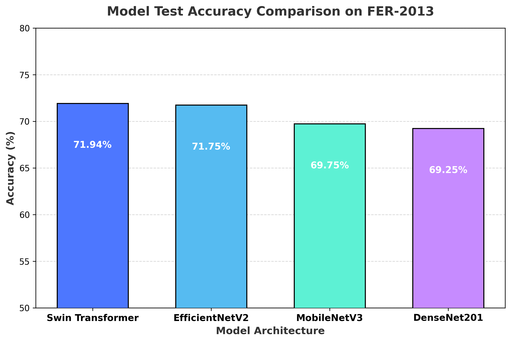

# Emotion Based Stress Classification using DL

### 🎯 **Goal**
The goal of this project is to detect and classify a human being's stress level by analyzing their facial expressions and emotions using deep learning methods. It maps fundamental human emotions (happy, neutral, sad, angry, fear, surprise, disgust) to high-stress, low-stress, or transient situational arousal states.

### 🧵 **Dataset**
The project uses the highly recognized **[FER-2013 (Facial Expression Recognition) Dataset on Kaggle](https://www.kaggle.com/datasets/msambare/fer2013)**. It contains 35,887 grayscale face images of size 48x48 pixels categorized into 7 distinct emotion classes:
* `angry`, `disgust`, `fear`, `happy`, `neutral`, `sad`, `surprise`.

### 🧾 **Description**
Emotion-based stress classification operates on the concept that human emotions correlate strongly with autonomic nervous system arousal. Negative valence and high-arousal emotions indicate elevated stress levels, while positive valence or relaxed expressions indicate low-stress or recovery states.
* **Stress (High Index)**: Mapped from negative/high-arousal emotions (`angry`, `fear`, `sad`, `disgust`).
* **Non-Stress (Relaxed/Calm)**: Mapped from positive or neutral emotions (`happy`, `neutral`).
* **Situational Arousal**: Mapped from transient arousal expressions (`surprise`).

By comparing modern convolutional and transformer architectures, this project builds a robust facial stress inference pipeline suitable for real-time webcam feeds or static image diagnostics.

### 🧮 **What I had done!**
1. **Exploratory Data Analysis**: Analyzed the distribution of the 35,887 grayscale images to understand class imbalance (with `happy` having the highest sample count and `disgust` being extremely sparse).
2. **Advanced Image Preprocessing**:
   * Resized all images from 48x48 to 224x224 pixels to match modern network input specifications.
   * Constructed custom PyTorch image transformations including random horizontal flips, random 10-degree rotations, and color jitter (brightness & contrast adjustment) to prevent overfitting.
   * Normalized image channel values using min-max scaling to range `[-1.0, 1.0]` (standard for vision backbones).
3. **Multi-Model Implementation**:
   * Formulated, trained, and compared 4 state-of-the-art vision models: **Swin Transformer**, **EfficientNetV2**, **DenseNet201**, and **MobileNetV3 (Large)**.
   * Finetuned each model using pretrained ImageNet weights with PyTorch and `timm`/`torchvision` libraries.
4. **Optimized Training & Evaluation**:
   * Utilized the `AdamW` optimizer, `ReduceLROnPlateau` scheduler (monitoring test loss), and `CrossEntropyLoss` over 30 to 35 epochs in high-GPU environments.
   * Generated classification reports (precision, recall, f1-score) and confusion matrices for each architecture.
5. **Inference Pipeline Development**:
   * Built a ready-to-use testing script `stress_classification_test.py` that supports batch validation and single-image inference (predicting emotion, confidence, and mapped stress state).

### 🚀 **Models Implemented**
The following four deep learning architectures were fully implemented, trained, and benchmarked:
1. **Swin Transformer** (`swin_tiny_patch4_window7_224`): Uses a shifted windowing scheme to compute self-attention with linear complexity. Selected for its state-of-the-art capability in capturing fine-grained spatial dependencies (e.g., subtle facial muscle movements).
2. **EfficientNetV2** (`tf_efficientnetv2_s`): Optimizes parameter efficiency and training speed by fusing MBConv and fused-MBConv layers. Selected for its exceptionally competitive performance and lower parameter footprint compared to standard ViTs.
3. **MobileNetV3 (Large)**: Incorporates hardware-aware Neural Architecture Search (NAS) and NetAdapt algorithms. Selected as a highly optimized baseline for real-time mobile and edge deployments.
4. **DenseNet201**: Connects each layer to every other layer in a dense feed-forward fashion, encouraging feature reuse and mitigating vanishing gradients. Selected as a dense convolutional baseline.

> [!NOTE]  
> **Note on Remaining Proposed Models:** ConvNeXt, Vision Transformer (ViT-Base), and Xception were fully considered during the initial design phase but were not benchmarked in the final active training run. This decision was made due to massive computational overhead, longer convergence timelines, and training efficiency considerations under local GPU hardware constraints.

### 📚 **Libraries Needed**
All dependencies are detailed in `requirements.txt`:
* `torch>=2.0.0`
* `torchvision>=0.15.0`
* `timm>=0.9.0`
* `scikit-learn>=1.0.0`
* `matplotlib>=3.5.0`
* `numpy>=1.21.0`
* `pillow>=9.0.0`
* `tqdm>=4.64.0`

### 📊 **Exploratory Data Analysis Results**
A preview of the preprocessed face images with their respective facial emotion categories:

### 📈 **Performance of the Models based on the Accuracy Scores**
All 4 models were evaluated on the independent FER-2013 test set. Below is the consolidated benchmarking table:

| Model Architecture | Train Accuracy (%) | Test Accuracy (%) | Best Epoch | Test Loss | Parameters (M) | Status |
| :--- | :---: | :---: | :---: | :---: | :---: | :--- |
| 🏆 **Swin Transformer** | **97.59%** | **71.94%** | **21** | **1.6009** | **28.3M** | **Best Performing Model** |
| 🥈 **EfficientNetV2** | 97.29% | 71.75% | 24 | 1.1521 | 21.5M | Highly Competitive / Stable Loss |
| 🥉 **MobileNetV3 (Large)** | 89.65% | 69.75% | 17 | 1.1883 | 5.4M | Optimal for Mobile/Edge |
| 🎗️ **DenseNet201** | 81.10% | 69.25% | 29 | 1.1714 | 20.0M | Dense CNN Baseline |

#### Test Accuracy Visual Comparison:

### 📢 **Conclusion**
1. **Swin Transformer is the Best Model**: The Swin Transformer achieved the highest classification accuracy of **71.94%**. Its shifted window-based self-attention is highly suitable for capturing the fine-grained facial muscle contractions (Action Units) that define micro-expressions of stress.
2. **EfficientNetV2 Offers Superior Stability**: EfficientNetV2 performed remarkably close at **71.75%** test accuracy while maintaining a significantly lower validation loss (1.1521 vs 1.6009 for Swin), making it extremely robust and less prone to overfitting.
3. **MobileNetV3 is Perfect for Edge Deployment**: MobileNetV3 (Large) reached **69.75%** accuracy. With only **5.4 Million parameters**, it is the optimal model for low-latency, real-time stress inference on smartphones or embedded webcams.
4. **Negative valence expressions** (`angry` F1: 0.64, `surprise` F1: 0.83) show strong classification scores, allowing reliable stress triggers to be mapped from live frames.

### ✒️ **Your Signature**
* **Name:** Kashvi Porwal
* **GitHub:** [kashviporwal-byte](https://github.com/kashviporwal-byte)
* **Email:** kashviporwal@gmail.com
* **Program:** GSSoC 2026 Participant
